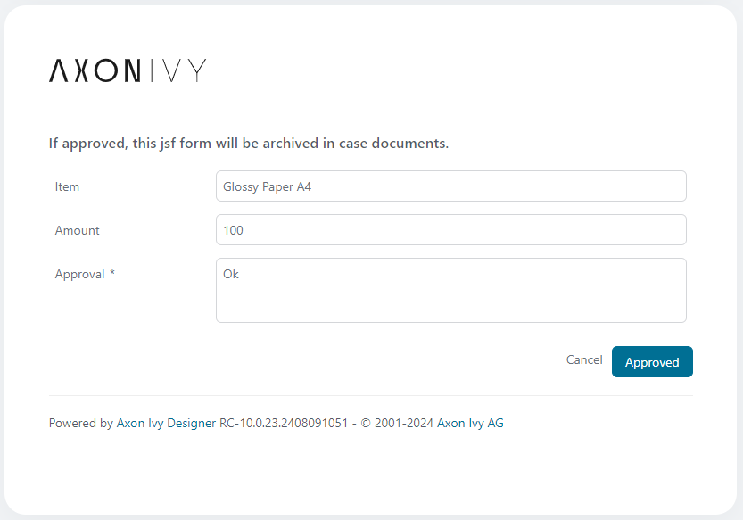
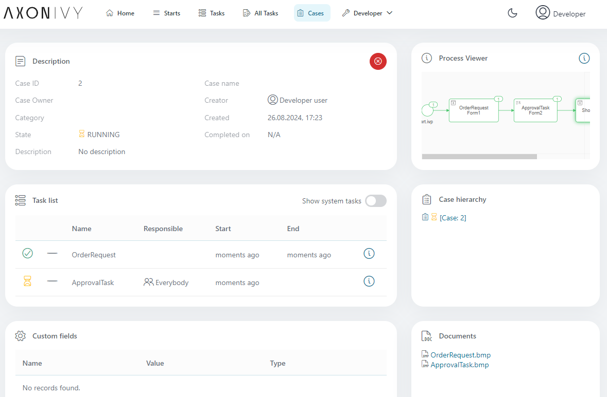

<!--
Dear developer!     

When you create your very valuable documentation, please be aware that this Readme.md is not only published on github. This documentation is also processed automatically and published on our website. For this to work, the two headings "Demo" and "Setup" must not be changed
-->

# JSF Form Archive Utility

This utility adds a snapshot of submitted jsf dialogs to case documents. After a form has been submitted you will find the created snapshot image on the case detail page. The task name will be taken as document name.


## Demo

Just submit the form and you will find a snapshot of the form in the case documents on the case detail page.

   

   

## Setup

To make use of this utility you have to adapt the "submit" commandButton in the dialogs in your process that you want to have archived. 
Change the default commandButton, that may look like
  ```
  <p:commandButton actionListener="#{logic.close}" value="Proceed" update="form" icon="pi pi-check" />
  ``` 
to
  ```
  <p:commandButton oncomplete="if(!args.validationFailed){saveCanvas()}" value="Proceed" />
  <ui:include src="/includes/save-canvas.xhtml" />
  ```
