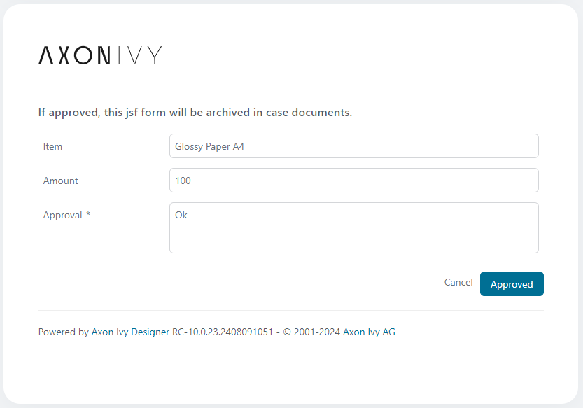
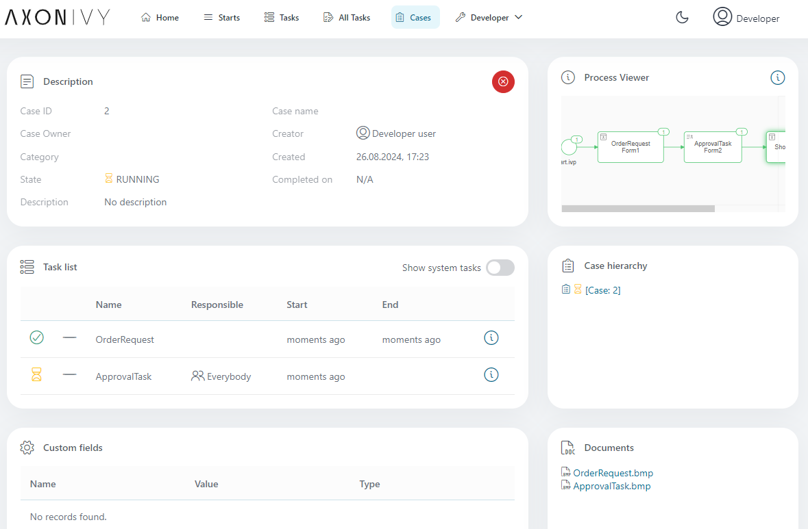

# JSF-Formulararchiv-Dienstprogramm

Mit diesem Dienstprogramm können Sie Snapshots Ihrer JSF-Benutzeroberflächen
erstellen und so auf benutzerfreundliche Weise archivieren, welche
(Benutzer-)Eingaben zu bestimmten Zeitpunkten vorgenommen wurden.

- Nachdem ein Formular abgeschickt wurde, finden Sie das erstellte Snapshot-Bild
  auf der Seite mit den Fall-Details.
- Der Name der Aufgabe wird als Bildname verwendet.

## Demo

Senden Sie einfach das Formular ab, und Sie finden einen Screenshot des
Formulars in den Fallunterlagen auf der Seite mit den Falldetails.





## Setup

Um dieses Dienstprogramm nutzen zu können, müssen Sie die Schaltfläche „Senden”
in den Dialogen Ihres Prozesses anpassen, die Sie archivieren möchten. Ändern
Sie die Standard-Schaltfläche, die möglicherweise wie folgt aussieht
  ```
  <p:commandButton actionListener="#{logic.close()}" value="Proceed" update="form" icon="pi pi-check" />
  ```
zu
  ```
  <p:commandButton oncomplete="if(!args.validationFailed){saveCanvas()}" value="Proceed" />
  <ic:jsf.form.archive.util.SaveCanvas form="form" submitListener="#{logic.close()}" />
  ```
Möglicherweise möchten Sie mit dieser Änderung einen neuen Ansichtstyp in den
HTML-Vorlageneinstellungen Ihres Designers erstellen.
